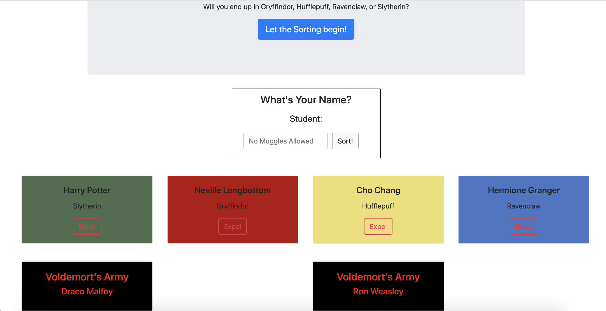

# Sorting Hat Exercise

## Description
This is a Harry Potter-themed homework assignment to practice using Bootstrap and Javascript event listeners to recreate the Sorting Hat.

### Feature List
* Randomly assigns any name you give it to one of the four Hogwarts houses
* Prevents sorting a null value for a name
* Expel button deletes sorted student 
* The background color of each card prints with the corresponding color of the house into which they were sorted.
* Expelled students reappear as members of Voldemort's Army with different styling

### How To Run
1. Clone the repo to have it on your local machine
1. Use `hs` to start up a local server
1. Visit the server in your browser (defaults to localhost:8080)

### Screenshots

### Contributors
* [Jeanine Beckle](https://github.com/jeaninebeckle)
